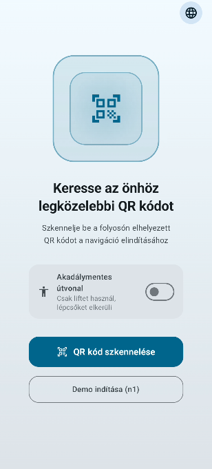
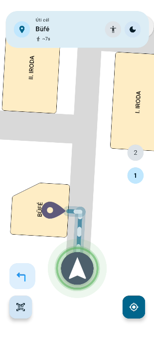
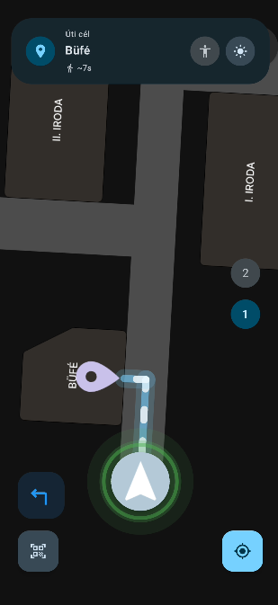

# Hall Finder — Indoor Navigation App

Android alapú beltéri navigációs alkalmazás, amely valós idejű szenzorfúziót, A* útvonalkeresést és QR-kódos pozicionálást kombinál. A cél egy olyan rendszer, amely GPS nélkül, kizárólag a telefon beépített szenzoraira és az épületbe telepített hardverre támaszkodva képes megbízhatóan navigálni zárt terekben.


<div align="center">
  
  
  
</div>

## Funkciók

**Navigáció és pozicionálás**

A mozgáskövetés Pedestrian Dead Reckoning (PDR) alapon működik: a telefon lépésérzékelője és forgásvektora együtt adja meg, hogy a felhasználó merre és mennyit haladt. Lépést csak akkor regisztrál a rendszer, ha a telefon iránya egyezik az útvonal irányával — ez kiszűri a helyben forgolódást és az eszközrázkódásból eredő zajt.

A kezdőpont kalibrálása QR-kód beolvasásával történik, amelyet a folyosókon elhelyezett kódok biztosítanak. A beolvasáshoz az app a Google ML Kit barcode scanning könyvtárát használja.

Az útvonaltervezés A* algoritmussal dolgozik egy előre definiált gráfon, amely tartalmazza az épület összes csomópontját, folyosóit és szintváltási lehetőségeit (lépcső, lift).

**BLE checkpoint rendszer**

Az épületbe elhelyezett ESP32 mikrocontrollerek BLE beacon módban folyamatosan sugározzák az azonosítójukat. Amikor a telefon elég közel kerül egy beaconhöz (kb. 1–3 méter, -55 dBm jelerősség felett), az alkalmazás automatikusan a checkpoint pozíciójára snapel és újraszámítja az útvonalat. Ez rendszeresen korrigálja a lépésszámláló által felhalmozott eltérést, és növeli a navigáció hosszú távú pontosságát.

**Akadálymentes útvonaltervezés**

Bekapcsolható üzemmód mozgáskorlátozottak számára: ilyenkor az útvonaltervező kizárja a lépcsőket és kizárólag lifteken keresztül tervez szintváltást. A kapcsoló elérhető a QR-kód beolvasása előtt és navigáció közben is.

**Irány visszajelző**

A navigációs nyíl körül egy színes glowing kör jelzi, hogy a felhasználó megfelelő irányba néz-e. Zöld jelzi a helyes irányt, sárga a kisebb eltérést, piros a rossz irányt. A váltás animált átmenettel történik.

**Fordulási utasítások**

A következő kereszteződésnél szükséges fordulat iránya egy külön panelen jelenik meg a képernyő bal alsó sarkában. A panel megkülönbözteti az egyenes haladást, az enyhe és az éles bal/jobb fordulatokat, és szín szerint is jelzi az utasítás típusát.

**Menetidő becslés**

Az útvonal teljes hosszából és egy átlagos gyaloglási sebesség alapján az alkalmazás megbecsüli a várható menetidőt, amely a célállomás neve alatt jelenik meg.

**Kedvencek**

Bármely célállomás elmenthető kedvencként a keresési listában lévő csillag ikonra koppintva. A kedvencek a telefon helyi tárolójában maradnak meg (SharedPreferences), szerverre vagy regisztrációra nincs szükség. A mentett helyek külön szekcióban jelennek meg a keresőben.

**Egyéb**

- Kétszintes térképmegjelenítés manuális emeletváltóval
- Google Maps-szerű kamerakövetés: navigáció közben a térkép automatikusan a felhasználóra fókuszál és forog az iránytű szerint, kézzel szétcsípve vagy forgatva kikapcsol, a visszaközpontosítás gombbal visszakapcsolható
- Magyar és angol nyelv, világos és sötét téma
- Immersive mód (navigációs sávok elrejtve)

## Technológiai stack

| Réteg | Technológia |
|---|---|
| Nyelv | Kotlin |
| UI | Jetpack Compose, Material Design 3 |
| Kamera & vonalkód | CameraX, Google ML Kit Barcode Scanning |
| Szenzorfúzió | Android SensorManager (TYPE_STEP_DETECTOR, TYPE_ROTATION_VECTOR) |
| Bluetooth | Android BLE API (BluetoothLeScanner) |
| Helyi tárolás | SharedPreferences |
| Animációk | Compose Animation API (Animatable, animateFloatAsState, animateColorAsState) |
| Útvonaltervezés | A* algoritmus egyedi gráfon |

## Hogyan működik

1. **QR beolvasás** — a felhasználó beolvassa a legközelebbi folyosói QR kódot, amely meghatározza a kezdőpontot a gráfon
2. **Útvonaltervezés** — az A* algoritmus kiszámolja az optimális útvonalat a célállomásig, figyelembe véve az akadálymentesség beállítást
3. **Navigáció** — a lépésérzékelő és az iránytű folyamatosan frissíti a pozíciót; a térkép forog és követi a felhasználót
4. **Checkpoint korrekció** — ha a telefon közel kerül egy BLE beaconhöz, a rendszer automatikusan korrigálja a pozíciót és újraszámítja az útvonalat

## Telepítés

```bash
git clone https://github.com/felhasznaloneved/hall-finder.git
```

Nyisd meg a projektet Android Studióban, szinkronizáld a Gradle fájlokat, majd futtasd egy fizikai eszközön. Emulátoron a lépésszámláló, a kamera és a Bluetooth funkciók nem elérhetők.

Az alkalmazás az alábbi engedélyeket kéri indításkor: kamera (QR olvasáshoz), fizikai aktivitás (lépésszámlálóhoz), Bluetooth scan és connect (BLE checkpointokhoz).

## ESP32 beacon beállítása

A checkpoint rendszer ESP32 mikrokontrollereket használ BLE beacon módban. Minden eszköz a hozzá rendelt node azonosítóját sugározza (pl. `n4`). A firmware feltöltéséhez Arduino IDE szükséges, az ESP32 board support package telepítésével. A beacon szkript megtalálható a `/esp32_script` mappában.
